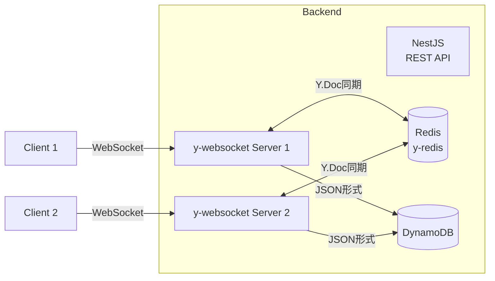
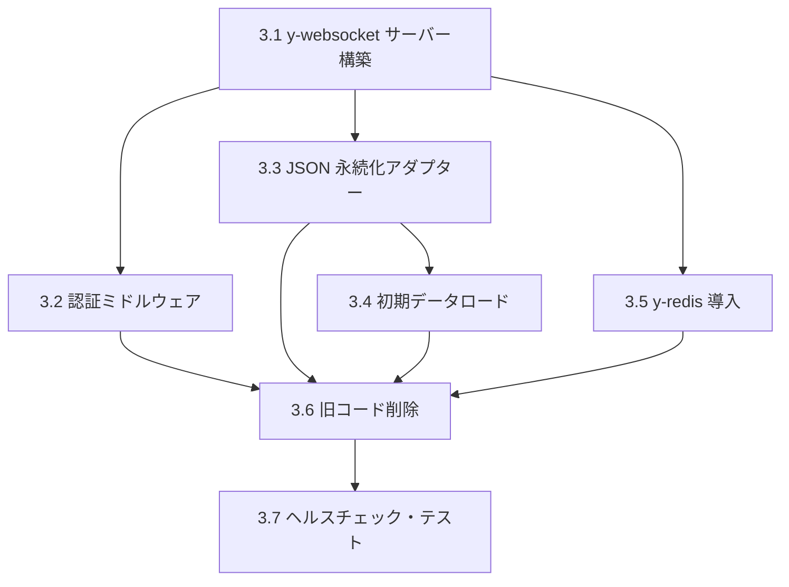

# Phase 3: バックエンド変更

## 概要

既存の Socket.IO + DynamoDB 構成から、y-websocket サーバー（別プロセス）+ JSON 永続化へ移行する。スケーリングは y-redis で対応し、既存の Socket.IO 用 Redis アダプターは削除する。

## 移行後のアーキテクチャ



## 決定事項

- y-websocket サーバーは **別プロセス** で起動（NestJS は REST API 専用）
- LevelDB / IndexedDB は **不使用**（Y.Map → DynamoDB 直接保存）
- スケーリングは **y-redis** で対応（既存 Socket.IO 用 Redis アダプターは削除）

---

## タスク一覧

| #   | タスク                      | 優先度 | 見積もり | 依存               | 詳細                                                         |
| --- | --------------------------- | ------ | -------- | ------------------ | ------------------------------------------------------------ |
| 3.1 | y-websocket サーバーの構築  | P1     | 0.5 日   | -                  | [01-y-websocket-server.md](./tasks/01-y-websocket-server.md) |
| 3.2 | 認証ミドルウェアの実装      | P2     | 0.5 日   | 3.1                | [02-auth-middleware.md](./tasks/02-auth-middleware.md)       |
| 3.3 | JSON 永続化アダプターの実装 | P2     | 0.5 日   | 3.1                | [03-json-persistence.md](./tasks/03-json-persistence.md)     |
| 3.4 | 初期データロード機能        | P3     | 0.5 日   | 3.3                | [04-initial-data-load.md](./tasks/04-initial-data-load.md)   |
| 3.5 | y-redis の導入              | P2     | 0.5 日   | 3.1                | [05-y-redis.md](./tasks/05-y-redis.md)                       |
| 3.6 | 旧 Socket.IO コードの削除   | P4     | 0.25 日  | 3.2, 3.3, 3.4, 3.5 | [06-cleanup-old-code.md](./tasks/06-cleanup-old-code.md)     |
| 3.7 | ヘルスチェック・監視の追加  | P5     | 0.5 日   | 3.6                | [07-health-monitoring.md](./tasks/07-health-monitoring.md)   |

---

## 依存関係



---

## 実行順序（推奨）

### Phase 3.1: 基盤構築

1. **3.1 y-websocket サーバーの構築** - 最優先

### Phase 3.2: コア機能（並行実行可能）

2. **3.2 認証ミドルウェア**
3. **3.3 JSON 永続化アダプター**
4. **3.5 y-redis の導入**

### Phase 3.3: データ連携

5. **3.4 初期データロード** - 3.3 完了後

### Phase 3.4: クリーンアップ

6. **3.6 旧コード削除** - 全コア機能完了後

### Phase 3.5: 運用準備

7. **3.7 ヘルスチェック・監視**

---

## 見積もり

| タスク                   | 見積もり      |
| ------------------------ | ------------- |
| y-websocket サーバー構築 | 0.5 日        |
| 認証ミドルウェア         | 0.5 日        |
| JSON 永続化アダプター    | 0.5 日        |
| 初期データロード         | 0.5 日        |
| y-redis 導入             | 0.5 日        |
| 旧コード削除             | 0.25 日       |
| ヘルスチェック・テスト   | 0.5 日        |
| **合計**                 | **3.25-4 日** |

---

## ファイル構成（移行後）

```
src/
├── yjs-server/
│   ├── index.ts              # エントリーポイント
│   ├── auth.ts               # 認証ミドルウェア
│   ├── persistence.ts        # JSON 永続化ロジック
│   ├── y-redis-provider.ts   # y-redis プロバイダー
│   ├── health.ts             # ヘルスチェック
│   └── metrics.ts            # メトリクス収集
├── shared/
│   └── jwt-verifier.ts       # JWT 検証（NestJS/y-websocket 共通）
├── white-board/
│   ├── dynamodb.service.ts   # 再利用
│   ├── s3.service.ts         # 再利用
│   ├── drawing.types.ts      # 再利用
│   └── white-board.module.ts # 更新
├── auth/
│   └── auth.service.ts       # 共通モジュール使用に更新
└── ...
```

---

## 削除対象

### ファイル

- `src/white-board/white-board.gateway.ts`
- `src/redis-io.adapter.ts`

### パッケージ

- `@nestjs/platform-socket.io`
- `@nestjs/websockets`
- `socket.io`
- `@socket.io/redis-adapter`
- `ioredis`
