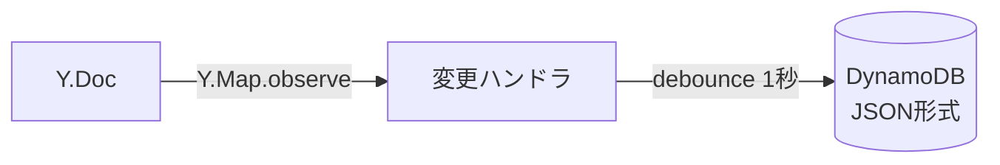

# 3.3 JSON 永続化アダプターの実装

## メタ情報

| 項目       | 値                                           |
| ---------- | -------------------------------------------- |
| 優先度     | P2                                           |
| 見積もり   | 0.5 日                                       |
| 依存タスク | [01-y-websocket-server.md](./01-y-websocket-server.md) |
| ステータス | 未着手                                       |

## 概要

Y.Doc の変更を監視し、JSON 形式で DynamoDB に直接保存する永続化アダプターを実装する。LevelDB は使用せず、既存のデータ構造との互換性を維持する。

## データフロー



## 作業内容

### 1. 永続化ロジックの実装

`src/yjs-server/persistence.ts`:

```typescript
import * as Y from 'yjs'
import { DynamoDBService } from '../white-board/dynamodb.service'
import { Drawing } from '../white-board/drawing.types'

// debounce 用のタイマー管理
const saveTimers = new Map<string, NodeJS.Timeout>()
const DEBOUNCE_MS = 1000

export function setupPersistence(doc: Y.Doc, roomId: string, dynamoDBService: DynamoDBService) {
  const yDrawings = doc.getMap<Drawing>('drawings')

  yDrawings.observe((event) => {
    // 既存のタイマーをクリア
    const existingTimer = saveTimers.get(roomId)
    if (existingTimer) {
      clearTimeout(existingTimer)
    }

    // debounce して保存
    const timer = setTimeout(async () => {
      try {
        const drawings = Array.from(yDrawings.values())
        await saveDrawingsToDynamoDB(roomId, drawings, dynamoDBService)
        saveTimers.delete(roomId)
      } catch (error) {
        console.error(`Failed to save drawings for room ${roomId}:`, error)
      }
    }, DEBOUNCE_MS)

    saveTimers.set(roomId, timer)
  })
}

async function saveDrawingsToDynamoDB(
  roomId: string,
  drawings: Drawing[],
  dynamoDBService: DynamoDBService
): Promise<void> {
  // 既存の DynamoDBService のメソッドを使用
  await dynamoDBService.saveDrawings(roomId, drawings)
}
```

### 2. DynamoDBService の調整

既存の `src/white-board/dynamodb.service.ts` を y-websocket サーバーから利用できるよう、NestJS の DI コンテナ外でもインスタンス化できるようにする。

```typescript
// NestJS 外でも使用可能なファクトリ関数を追加
export function createDynamoDBService(): DynamoDBService {
  const s3Service = new S3Service()
  return new DynamoDBService(s3Service)
}
```

### 3. index.ts への統合

```typescript
import { setupPersistence } from './persistence'
import { createDynamoDBService } from '../white-board/dynamodb.service'

const dynamoDBService = createDynamoDBService()
const docs = new Map<string, Y.Doc>()

// ドキュメント作成時に永続化をセットアップ
function getOrCreateDoc(roomId: string): Y.Doc {
  let doc = docs.get(roomId)
  if (!doc) {
    doc = new Y.Doc()
    setupPersistence(doc, roomId, dynamoDBService)
    docs.set(roomId, doc)
  }
  return doc
}
```

## 完了条件

- [ ] Y.Map への変更が DynamoDB に JSON 形式で保存される
- [ ] debounce により高頻度の更新がバッチ処理される
- [ ] 既存の DrawingRecord 形式との互換性が維持される
- [ ] エラー時にもサーバーがクラッシュしない

## 関連ファイル

- `src/yjs-server/persistence.ts`（新規作成）
- `src/white-board/dynamodb.service.ts`（ファクトリ関数追加）
- `src/yjs-server/index.ts`（更新）

## 次のタスク

- [04-initial-data-load.md](./04-initial-data-load.md)

