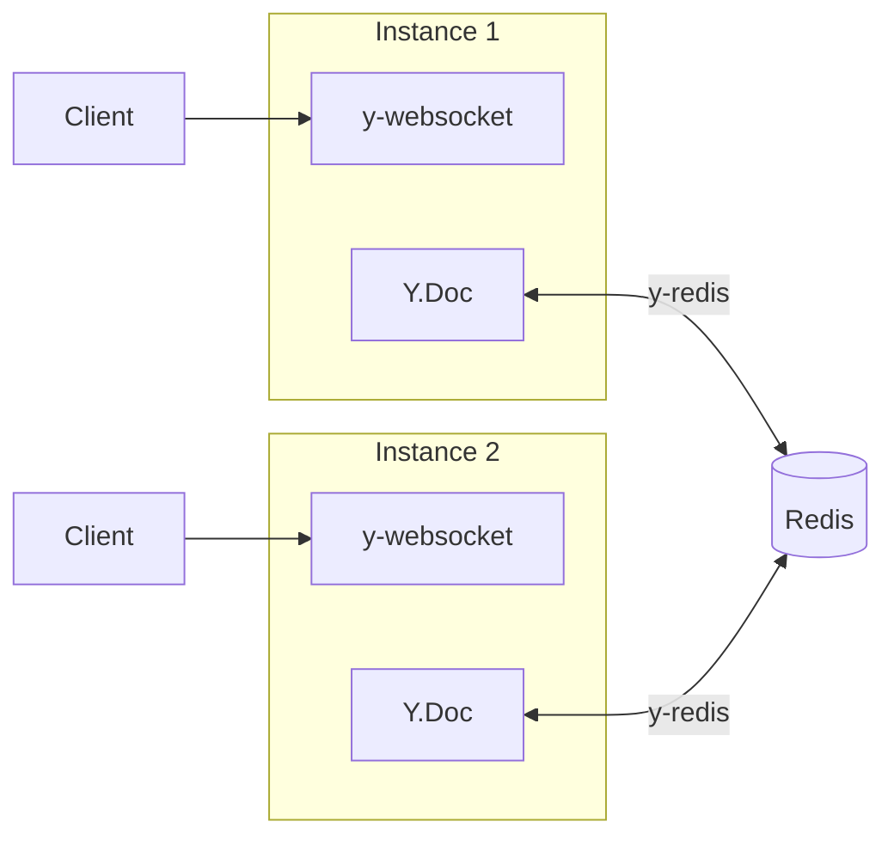

# 3.5 y-redis の導入

## メタ情報

| 項目       | 値                                                     |
| ---------- | ------------------------------------------------------ |
| 優先度     | P2                                                     |
| 見積もり   | 0.5 日                                                 |
| 依存タスク | [01-y-websocket-server.md](./01-y-websocket-server.md) |
| ステータス | 未着手                                                 |

## 概要

複数の y-websocket サーバーインスタンス間で Y.Doc を同期するため、y-redis を導入する。既存の Redis インフラ（ElastiCache 等）を再利用する。

## 注意

既存の `src/redis-io.adapter.ts` は **Socket.IO 用** の Redis アダプターであり、y-redis とは別物。こちらは [06-cleanup-old-code.md](./06-cleanup-old-code.md) で削除対象。

## 作業内容

### 1. パッケージの導入

```bash
pnpm add @y/redis redis
```

### 2. Redis 接続の設定

`src/yjs-server/redis.ts`:

```typescript
import { createClient } from 'redis'

export async function createRedisClient() {
  const client = createClient({
    url: process.env.REDIS_URL || 'redis://localhost:6379',
  })

  client.on('error', (err) => console.error('Redis Client Error:', err))

  await client.connect()
  return client
}
```

### 3. y-redis プロバイダーの設定

`src/yjs-server/y-redis-provider.ts`:

```typescript
import * as Y from 'yjs'
import { createYRedisClient } from '@y/redis'

let yRedisClient: ReturnType<typeof createYRedisClient> | null = null

export async function initYRedis() {
  yRedisClient = createYRedisClient({
    redisUrl: process.env.REDIS_URL || 'redis://localhost:6379',
  })
}

export function getYRedisClient() {
  if (!yRedisClient) {
    throw new Error('y-redis client not initialized')
  }
  return yRedisClient
}

export async function bindDocToRedis(doc: Y.Doc, roomId: string) {
  const client = getYRedisClient()
  return client.bindState(roomId, doc)
}
```

### 4. index.ts への統合

```typescript
import { initYRedis, bindDocToRedis } from './y-redis-provider'

// サーバー起動時に Redis を初期化
async function main() {
  await initYRedis()

  const wss = new WebSocketServer({ port: Number(process.env.YJS_WS_PORT || 1234) })

  wss.on('connection', async (conn, req) => {
    // 認証チェック
    const isAuthenticated = await authenticate(req)
    if (!isAuthenticated) {
      conn.close(4001, 'Unauthorized')
      return
    }

    const url = new URL(req.url || '', 'http://localhost')
    const roomId = url.pathname.slice(1) || 'default'

    // ドキュメントを取得
    const doc = await getOrCreateDoc(roomId)

    // Redis にバインド（他インスタンスと同期）
    await bindDocToRedis(doc, roomId)

    setupWSConnection(conn, req, { doc, docName: roomId })
  })

  console.log(`y-websocket server running on port ${process.env.YJS_WS_PORT || 1234}`)
}

main().catch(console.error)
```

### 5. 環境変数

| 変数名    | 説明           | デフォルト             |
| --------- | -------------- | ---------------------- |
| REDIS_URL | Redis 接続 URL | redis://localhost:6379 |

## アーキテクチャ



## 完了条件

- [ ] y-redis が Redis に接続できる
- [ ] 異なるインスタンスに接続したクライアント間で変更が同期される
- [ ] Redis 接続エラー時に適切にハンドリングされる
- [ ] 既存の ElastiCache で動作確認

## 関連ファイル

- `src/yjs-server/redis.ts`（新規作成）
- `src/yjs-server/y-redis-provider.ts`（新規作成）
- `src/yjs-server/index.ts`（更新）

## 次のタスク

- [06-cleanup-old-code.md](./06-cleanup-old-code.md)
